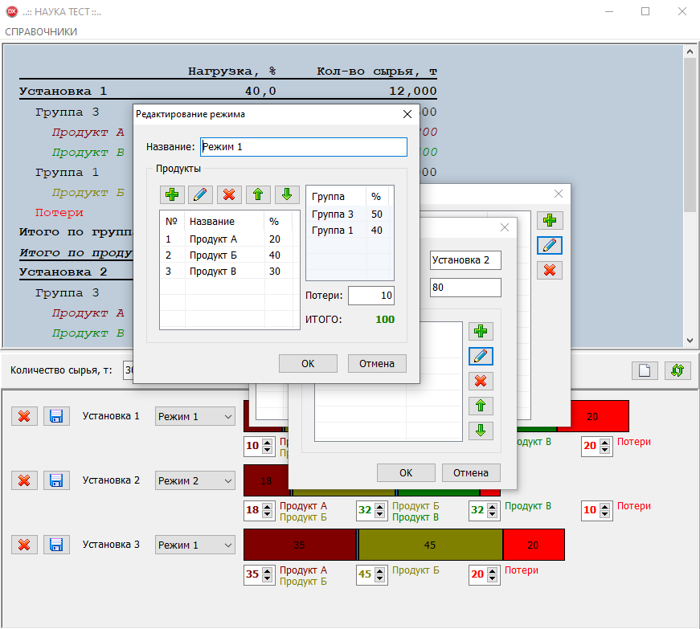

# intrerview_test_task_0
Simple desktop database client.

Тестовое задание

1. Справочники
Настраивается список (справочник) технологических установок (Установка1, Установка2, везде справочники состоят из наименования и кода, длина полей - произвольная, код короткий, справочники редактируемые, наполняются вручную).
Для каждой установки задаётся максимальный объем перерабатываемого сырья в тоннах – максимальная производительность.
Настраивается перечень (справочник) вырабатываемых продуктов (Продукт А, продукт Б и т.д.).
Продукты имеют признак группы (Группа 1, Группа 2 и т.д.).
В список добавляется продукт "Потери", не относящийся ни к одной группе.
По каждой установке настраивается список (справочник) технологических режимов (Режим 1, Режим 2 и т.д.). В режиме задаётся список вырабатываемых продуктов установкой и для каждого продукта задаётся коэффициент выработки от объема поступающего сырья в %; также в каждом режиме должен присутствовать обязательный продукт "Потери" со своим коэффициентом (пример: Режим 1: {1. Продукт А:10%, 2.Продукт Б:40%, 3.Потери:50%}).
При наборе продуктов в режим производится автоматический подсчёт суммы коэффициентов по каждой группе набранных в режим продуктов. Сумма коэффициентов всех продуктов плюс коэффициент для продукта "Потери" должны составлять 100%, иначе нельзя сохранить настройку режима. Порядок следования продуктов в режиме должен быть пронумерован и запомнен, в порядке следования нельзя перемешивать продукты из разных групп, продукт "Потери" должен быть всегда последним в списке.

2. Расчет производства
Пользователем задаётся список работающих установок, и для каждой указывается режим, в котором она будет работать. Далее пользователем вводится общее количество перерабатываемого сырья всем производством (в тоннах) и выполняется расчет – на основании пропорции из максимальных производительностей работающих установок рассчитывается количество сырья, перерабатываемого каждой установкой (в тоннах) (пример: ввели всего сырья 175 т, макс. производительность Установки1 – 120 т, Установки2 - 80 т, соответственно, Установка 1 переработает 60% сырья = 105 т, Установка2 - 40% = 75 т).
Для каждой установки рассчитывается объем выработки каждого продукта (в тоннах) и объем потерь (в тоннах) на основании коэффициентов выработки, заданных при настройке режима. На экране присутствуют все данные расчета – поле ввода общего объема сырья, выбор работающих установок и их режимов, в результирующих таблицах выводятся результаты расчета – для каждой установки выводится рассчитанный объем сырья (в тоннах), рассчитанные объемы выработки каждого продукта (в % и тоннах от объема взятого сырья) с подсчётом сумм (в % и тоннах) по группам вырабатываемых продуктов и общей суммой всех продуктов по установке, включая потери (в % и тоннах для проверки на 100% и равенству объема взятого сырья).
При редактировании значений объема общего сырья, при изменении набора работающих установок или их режимов производится автоматический перерасчёт схемы производства.

3. Моделирование
По каждой установке производства пользователю даётся возможность изменить предзаданные в настройках
режимов коэффициенты выработки продуктов (кроме продукта "Потери", по нему коэфф. остаётся всегда неизменен). Границы изменения коэффициента - 10% от предзаданного значения, т.е. увеличение или уменьшение возможно не более чем на 10 процентов от начального значения коэффициента (пример: в Режиме 1 для Продукта А задан коэффициент выработки от сырья – 20%, соответственно изменить его позволяется только в пределах от 18% до 22%). При изменении должно выполняться правило по установке – сумма всех коэффициентов вырабатываемых продуктов плюс коэффициент потерь должны быть равны100%, т.е. при изменении одного из коэффициентов должна выполняться нормализация значений остальных коэффициентов (не затрагивая коэффициент потерь).
Пример наглядной реализации: на экране рисуется полоска продуктов установки, состоящая из разноцветных прямоугольников, каждый прямоугольник соответствует вырабатываемому продукту из режима установки, а длина прямоугольника пропорциональна коэффициенту выработки этого продукта, заданному при настройке режима (продукт "Потери" не присутствует в полосе). Между соприкасающимися сторонами прямоугольников расположены сплиттеры, позволяющие сдвинуть совместно границы двух соседних прямоугольников, т.е. изменить предзаданные в режиме коэффициенты выработки соседних продуктов на величину не более 10%, при этом эти 10% рассчитываются от меньшего из двух предзаданных коэффициентов. Левая и правая границы полосы продуктов не содержат сплиттеров. При изменении значений коэффициентов выработки производится перерасчёт всех значений производства (см.п.2).

4. Результаты
Дать возможность сохранить полученные коэффициенты как новый режим, сформировать отчёт со всеми исходными, введенными, выбранными и рассчитанными в процессе расчета производства параметрами.
Для реализации выбрать любую бесплатную версию СУБД (mySQL или любую), спроектировать структуру БД, пользовательский интерфейс и печатную форму отчёта с предпросмотром на экране (любой инструмент).
